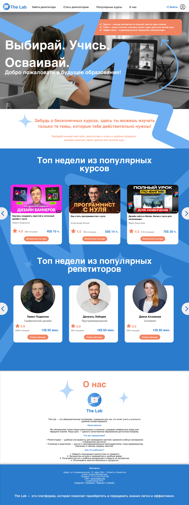

# portfolio
My design and IT achievements
Kudaibergenova Asyl — Portfolio
Привет! Меня зовут Кудайбергенова Асыл, я поступаю в университет по направлению "Менеджмент в ИТ" и имею опыт в графическом дизайне, UX/UI. Это мой портфолио-репозиторий с достижениями, кейсами и примерами работ.

Обо мне
Выпускница колледжа IT & Business College при Ala-Too International University, специальность: графический дизайн 
Владею инструментами: Figma, Tilda, Adobe Illustrator, Adobe Photoshop, Blender, Adobe Substanse 3D Painter, InDesign, After Effects.
[Участница студсовета](itBUS.jpg) и волонтёрских проектов

🧾 Рекомендации
Эльнура Алиева — руководитель технического отдела Ala-Too International University
Иршад Гулбарга — инженер-конструктор и преподаватель
Салтанат Лесбекова — замдиректора по воспитательной части
Мирлан Сарыбаев — замдиректора колледжа

📂 Проекты и примеры работ

Графический дизайн      Сайт по подбору репетиторов.[Посмотреть сайт](работагруппсайт.png)        Создание визуала для структурирования идей [Moodboard](мудборд.pdf)           Проектный логотип шахматной школы. [Logo](заданиелогошахматы.pdf)             Дизайн баннеров и афиш. [Посмотреть](постерыкконцертам.pdf) 	           Что такое [Brandbook](брендбукR.pdf)
Практическое задание на Государственный [экзамен](брендбукгосы.pdf)
[Постер](постеркиткат.pdf)
[Видео](https://drive.google.com/file/d/1Bs2hStFzIyAGAYoFFvHL0yE9jzg4Fh8H/view?usp=sharing) презентация для игры, созданная в групповом проекте. 
Digital competences [report](https://drive.google.com/file/d/1Xgas1cUcHYclF5-0DdbwG6AmGmdgyxOw/view?usp=sharing)
[Упаковка](https://drive.google.com/file/d/1BdODFOfgFJtE2K7YkG0-mVM2D8zokBIB/view?usp=sharing) детского ночника.
Логотип для [ALCHIKI](https://drive.google.com/file/d/1ICoQifaHdQeXGbxZQA9Z4ESzb0WUP8FQ/view?usp=sharing)
[Каталог](https://drive.google.com/file/d/1XqmutVdKr48iafliYixKwxxVec8Xufqf/view?usp=sharing) парфюма.
Mockup для производителя [меда](https://drive.google.com/file/d/1USVyKMyD007KSAUnyyXr4mD8b0LRC0ry/view?usp=sharing) [дизайн этикетки](https://drive.google.com/file/d/1q7EyPXrpmzZTeNouAxFNPtu37M6o8C7e/view?usp=sharing)
Видео рендер из [Blender](https://drive.google.com/file/d/16BQIUkQ1rFbQSUYs4lkDrMA-I73kC6q9/view?usp=sharing)

Графический дизайн

- Сайт по подбору репетиторов.  
  

- Создание визуала для структурирования идей:  
  [Moodboard](мудборд.pdf)

- Проектный логотип шахматной школы:  
  [Logo](заданиелогошахматы.pdf)

- Дизайн баннеров и афиш:  
  [Посмотреть](постерыкконцертам.pdf)

- Что такое [Brandbook](брендбукR.pdf)

- Практическое задание на Государственный  
  [экзамен](брендбукгосы.pdf)

- [Постер](постеркиткат.pdf)

- [Видео](https://drive.google.com/file/d/1Bs2hStFzIyAGAYoFFvHL0yE9jzg4Fh8H/view?usp=sharing) — презентация для игры, созданная в групповом проекте.

- Digital competences  
  [report](https://drive.google.com/file/d/1Xgas1cUcHYclF5-0DdbwG6AmGmdgyxOw/view?usp=sharing)

- [Упаковка](https://drive.google.com/file/d/1BdODFOfgFJtE2K7YkG0-mVM2D8zokBIB/view?usp=sharing) детского ночника.

- Логотип для [ALCHIKI](https://drive.google.com/file/d/1ICoQifaHdQeXGbxZQA9Z4ESzb0WUP8FQ/view?usp=sharing)

- [Каталог](https://drive.google.com/file/d/1XqmutVdKr48iafliYixKwxxVec8Xufqf/view?usp=sharing) парфюма.

- Mockup для производителя [меда](https://drive.google.com/file/d/1USVyKMyD007KSAUnyyXr4mD8b0LRC0ry/view?usp=sharing)  
  и [дизайн этикетки](https://drive.google.com/file/d/1q7EyPXrpmzZTeNouAxFNPtu37M6o8C7e/view?usp=sharing)

- Видео рендер из [Blender](https://drive.google.com/file/d/16BQIUkQ1rFbQSUYs4lkDrMA-I73kC6q9/view?usp=sharing)
🌟 Достижения
Участие в организации «Дня открытых дверей» в Ala-Too
Координатор поездки в Казахстан
Презентации и выступления от имени студсовета

Планы на будущее
Продолжить обучение в магистратуре по направлению Project Management / Digital Transformation
Создавать продукты, сочетающие дизайн, технологии и бизнес.

📫 Контакты
LinkedIn:https://www.linkedin.com/in/asyl-kudaibergenova-505a62327/ 
Email: asyl.kudaibergenova@alatoo.edu.kg

